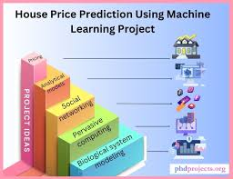

# House-Price-prediction
This project is a Machine Learning-based web application that predicts house prices based on important features such as median income, house age, and geographical location (latitude).The main objective of this project is to help users estimate property prices quickly and efficiently using data-driven techniques.
The model is trained using the California Housing dataset and utilizes regression algorithms such as Ridge Regression and Lasso Regression to achieve accurate predictions. Feature scaling is applied using StandardScaler to improve model performance.
# link
https://house-price-prediction-shph.onrender.com
# Key Features
Predict house prices using machine learning
Uses important features like income, age, and location
Implements Ridge and Lasso Regression models
Feature scaling using StandardScaler
Simple and interactive web interface using Flask
Deployment on cloud (Render)

# Technologies Used
Python
NumPy & Pandas
Scikit-learn
Flask
HTML & Bootstrap
# 🏠 House Price Prediction

